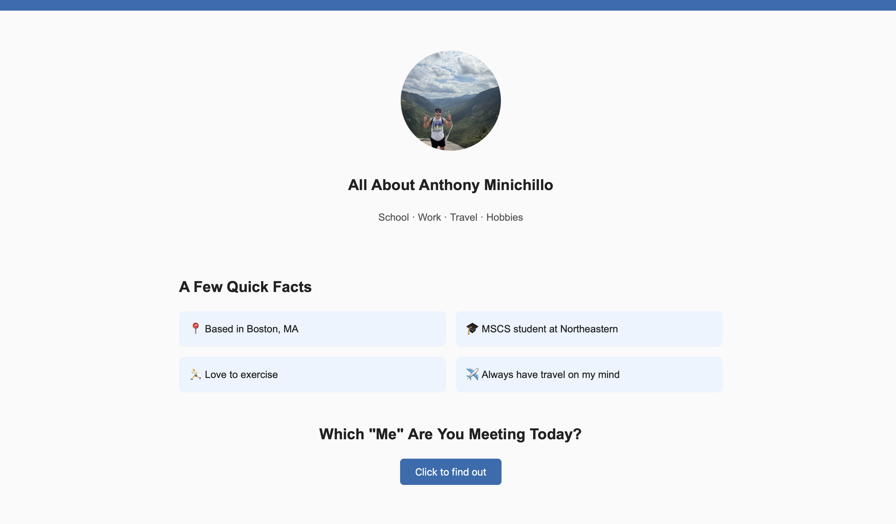

# Personal Homepage

## Author

Anthony Minichillo

## Class Link

[Web Development Class](https://johnguerra.co/classes/webDevelopment_online_fall_2026/students/index.html#)

## Project Objective

This project is a personal "About Me" homepage built using vanilla HTML5,
CSS3, and ES6+ JavaScript, as required for Web Development CS5200. The site
includes a home page, an about page, and an AI-generated interests page,
along with an original JavaScript feature (a "mood picker" that randomly
displays a different side of my personality).

## Screenshot

## Instructions to Build/Run

1. Clone or download this repository
2. Open the project folder in VS Code
3. No build step or dependencies are required to view the site
4. Open `index.html` directly in a browser, or use the "Live Server"
   VS Code extension for auto-reload during development
5. To format the code, run:
   \`\`\`
   npm install
   npm run format
   \`\`\`

## Use of GenAI Tools

- **Model used:** Claude Sonnet 5
- **How it was used:** Transparently Claude was used through this assignment quite a bit. I am trying to find the balance of using it to
  be time efficient with giving clarity rather than jumping through hoops with figuring things out on my own. I used it to keep me on track and from steering too far into error.
- **Example prompt used:** "What is a typical format of a License package and package.json" , even this README document, I just want to know the outline.
